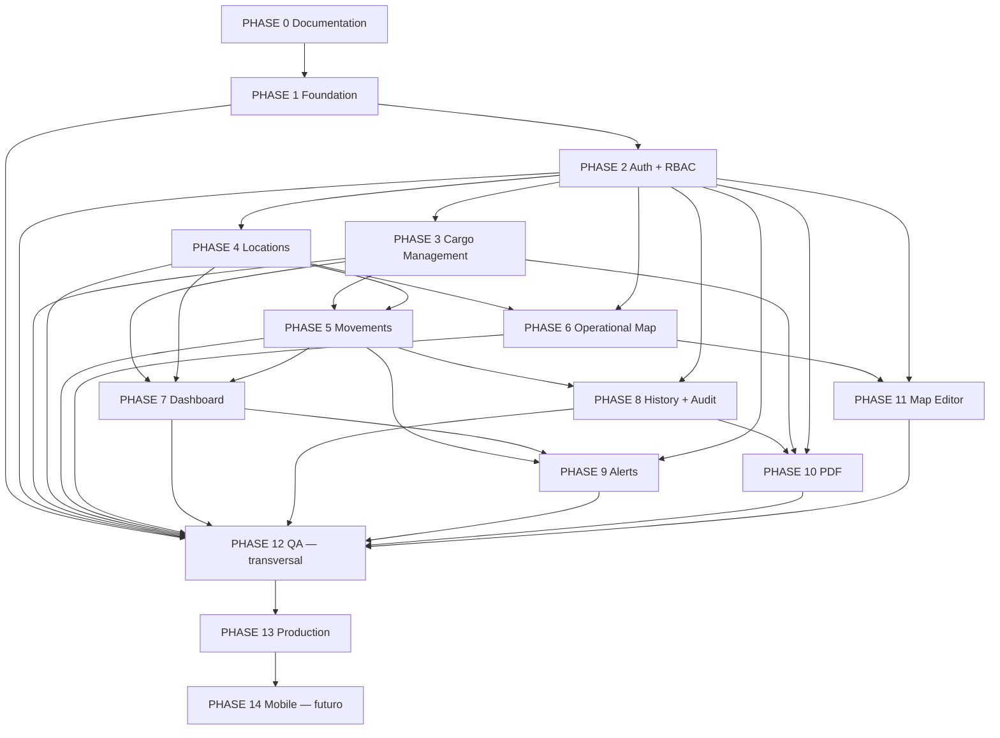

# CargoOps — Roadmap (PHASE 0–14)

> Fuente canónica: `docs/MASTER-SPEC.md` §18 (orden y nombre de fases). Este documento no redefine decisiones canónicas: las detalla en objetivos, entregables, dependencias, criterios de salida, riesgo y prioridad.
> Documentos relacionados: `docs/roadmap/PHASES.md` (desglose por fase en hitos/tareas), `docs/roadmap/IMPLEMENTATION-PLAN.md` (tareas para agentes de código), `docs/DEFINITION-OF-DONE.md` (checklists globales).

---

## 1. Objetivo

Definir el plan de fases completo del proyecto CargoOps (PHASE 0 → PHASE 14), con la vista de dependencias, las ventanas de solapamiento permitidas, los criterios de salida de cada fase (Definition of Finish de fase, DoF) y los riesgos/bloqueos asociados a decisiones pendientes del negocio.

## 2. Contexto

- CargoOps es una plataforma web de gestión operativa de cargas y depósitos en un predio logístico/aduanero (MASTER-SPEC §1).
- Estamos en **FASE 0 (documentación)**. Todo el detalle de las fases 1–14 es *planificación* para agentes de código (OpenCode + Big Pickle + Gentle-Orchestrator) que implementarán por etapas (MASTER-SPEC §1.2/§1.3).
- La arquitectura objetivo es **Modular Monolith** (ADR-001): un backend NestJS monomódulo y un frontend Angular, con repos futuros según MASTER-SPEC §22 (`cargoops-frontend`, `cargoops-backend`, `cargoops-mobile`, `cargoops-infrastructure`, `cargoops-docs`). La creación de repos git es decisión posterior a FASE 0.
- Varias fases dependen de decisiones de negocio aún abiertas (ver tablas: se referencian los IDs del documento `docs/OPEN-QUESTIONS.md`, OQ-001…OQ-045).

## 3. Restricciones

- No alterar el orden canónico ni el nombre de las fases (MASTER-SPEC §18): `0 Documentation → 1 Foundation → 2 Authentication + RBAC → 3 Cargo Management → 4 Locations → 5 Movements → 6 Operational Map → 7 Dashboard → 8 History + Audit → 9 Alerts → 10 PDF → 11 Map Editor → 12 QA → 13 Production → 14 Mobile`.
- FASE 0 solo produce documentación Markdown (no código, no repos, no despliegues).
- No inventar reglas de negocio: toda ambigüedad se registra como DECISIÓN PENDIENTE y se reporta al orquestador (MASTER-SPEC §6, §16).
- Una fase no se considera "abierta" si sus fases dependientes (tabla §5) no cumplieron sus criterios de salida (§4).
- El DoF de cada fase es el *criterio de salida* definido aquí, más el checklist de DoD de fase en `docs/DEFINITION-OF-DONE.md` §4.

## 4. Decisiones de planificación (este documento)

| # | Decisión |
| --- | --- |
| RMP-001 | Las fases se ejecutan en orden canónico; se permiten las ventanas de solapamiento listadas en §6. |
| RMP-002 | Escala de prioridad: **P0** crítica para el valor operativo, **P1** alta, **P2** media, **P3** endurecimiento, **P4** futuro. |
| RMP-003 | PHASE 0 es la puerta de entrada (gate): no se inicia PHASE 1 hasta completar el manifest de documentos (MASTER-SPEC §17) y consolidar OPEN-QUESTIONS. |
| RMP-004 | Si una fase tiene bloqueos 🔴 (OQ abiertas), se planifican las tareas no bloqueadas y las tareas bloqueadas quedan en "bloqueadas por OQ" (ver `IMPLEMENTATION-PLAN.md` §5). |
| RMP-005 | Cada fase cierra con: criterios de salida cumplidos + DoD de fase (§4 definición-of-done) + documentación de la fase actualizada + cero bloqueos 🔴 sin resolver o mitigación explícita del orquestador. |
| RMP-006 | PHASE 12 (QA) y PHASE 13 (Production) son fases transversales de endurecimiento: reciben salidas de 2..11 y no producen funcionalidad nueva. |
| RMP-007 | PHASE 14 (Mobile) es futura y opcional para v1; la arquitectura (API versionada, PWA, layouts responsive) debe dejarla habilitada sin reescribir (§1.5). |

## 5. Vista de dependencias

### 5.1 Mermaid

### 5.2 Tabla de dependencias

| Fase | Depende de (precedentes) | Es precedente de |
| --- | --- | --- |
| 0 Documentation | — (gate inicial) | 1 |
| 1 Foundation | 0 | 2, 12, 13 |
| 2 Authentication + RBAC | 1 | 3, 4, 6, 8, 9, 10, 11, 12 |
| 3 Cargo Management | 2 | 5, 7, 8, 10, 12 |
| 4 Locations | 1 (modelo de datos), 2 | 5, 6, 7, 12 |
| 5 Movements | 3, 4 | 7, 8, 9, 12 |
| 6 Operational Map | 4, 2 (viewer) | 11, 12 |
| 7 Dashboard | 3, 4, 5 | 9, 12 |
| 8 History + Audit | 5 (historial), 2 (auditoría de sesión) | 10, 12 |
| 9 Alerts | 5, 7 | 12 |
| 10 PDF | 8 (datos), 3, 2 | 12 |
| 11 Map Editor | 6, 2, 4 | 12 |
| 12 QA | 2..11 (transversal) | 13 |
| 13 Production | 12 | 14 |
| 14 Mobile | 13 (API estable y probada) | — (futuro) |

## 6. Solapamiento permitido entre fases

| Ventana | Fases | Regla |
| --- | --- | --- |
| W-1 | 1 → 2 | Solape con desfasaje (staggered): se inicia PHASE 2 cuando PHASE 1 tiene el skeleton backend + Prisma (tareas P1-T2/P1-T3) cerradas; no antes. |
| W-2 | 3 ∥ 4 | Paralelas tras PHASE 2: Cargo y Location son dominios independientes (solo comparten base de datos); la distribución M:N vía CargoLocation se consolida en PHASE 5. |
| W-3 | 5 → 6/7/8 | PHASE 5 habilita 6 (datos de ocupación), 7 y 8; se pueden iniciar 6/7/8 cuando 5 tenga movimientos básicos (P5-T2) cerrados. |
| W-4 | 7 ∥ 8 ∥ 9 | Detección de alertas (9) depende de 5; el dashboard (7) y el historial (8) alimentan la UI de alertas (9). Se ejecutan con hitos intercalados. |
| W-5 | 10 ∥ 11 | PDF y Editor de planos son independientes entre sí; ambos solo requieren sus propias precedentes. |
| W-6 | 12 | Oleadas: QA ingresa por fases (QA de 2..6 durante 7..11, QA final en 12). |
| NO solapar | 0/1 · 2/3 (RBAC antes de operaciones) · 12/13 (producción solo con QA cerrado) · 13/14 | Reglas duras: una no se inicia hasta el DoF de la anterior. |

## 7. Fases — detalle

> Formato por fase: prioridad, dependencias, riesgo, objetivo, entregables principales, criterios de salida (DoF), solapamiento, bloqueos por OQ.
> Riesgo: 🔴 alto (bloqueos de negocio o técnica fuerte) · 🟡 medio · 🟢 bajo.

### PHASE 0 — Documentation

| Atributo | Valor |
| --- | --- |
| Prioridad | P0 (gate) |
| Dependencias | — |
| Riesgo | 🟢 bajo (proceso), 🟡 si el manifest queda incompleto |

- **Objetivo**: producir el cuerpo documental completo (~60+ Markdown) que consume la implementación: producto, arquitectura, frontend, backend, UX, brand, QA, devops, roadmap.
- **Entregables principales**: manifest completo (MASTER-SPEC §17) con los grupos W1–W10; MASTER-SPEC; ADR-001..013; OPEN-QUESTIONS consolidado.
- **Criterios de salida (DoF)**: todos los archivos del manifest existen y sin secciones vacías; coherencia cruzada verificada; DECISIONES PENDIENTES reportadas y agregadas a OPEN-QUESTIONS; DoD de documentación (§3 de DEFINITION-OF-DONE.md) cumplido.
- **Solapamiento**: ninguno (es la fase inicial).
- **Bloqueos OQ**: ninguno bloquea documentar (el detalle de OQ-001..045 se incorpora como DECISIÓN PENDIENTE).

### PHASE 1 — Foundation

| Atributo | Valor |
| --- | --- |
| Prioridad | P0 |
| Dependencias | PHASE 0 |
| Riesgo | 🟡 (herramientas/versiones del stack: Angular 20, NestJS, Prisma, PostgreSQL 16) |

- **Objetivo**: base técnica común: scaffolding de frontend/backend cuando existan los repos (§22), tooling (TypeScript strict, ESLint, Prettier), Prisma + PostgreSQL (schema base), endpoints de salud, envelopes de API y entorno de desarrollo local.
- **Entregables principales**: skeleton backend NestJS modular (health, logging, error envelope); schema Prisma base (entidades §4.1, seed con las 17 ubicaciones de §5); skeleton frontend Angular standalone (`core/shared/features/...`, design tokens iniciales); CI base (lint + test + build); docker-compose de desarrollo.
- **Criterios de salida (DoF)**: `GET /api/v1/health` responde 200; build backend+frontend verdes; migraciones Prisma aplicables y seed ejecutable; CI lint/test/build verde; configuración de estándares (§15, `STANDARDS.md`) activa en ambos repos.
- **Solapamiento**: con PHASE 2 (ventana W-1, tras P1-T2/P1-T3).
- **Bloqueos OQ**: OQ-010 (SSR/PWA en v1) afecta solo la configuración de PWA del frontend — 🟡, no bloqueante de la fase.

### PHASE 2 — Authentication + RBAC

| Atributo | Valor |
| --- | --- |
| Prioridad | P0 |
| Dependencias | PHASE 1 |
| Riesgo | 🔴 (seguridad: JWT refresh, hashing, guards; errores aquí afectan todas las fases) |

- **Objetivo**: autenticación JWT + refresh (ADR-008) y RBAC de 3 roles (Viewer/Operator/Admin, §8, ADR-009) con permisos siempre validados en backend (BR-009).
- **Entregables principales**: módulo `auth` (login, refresh, logout); módulos `users`, `roles`, `permissions` con seed de 3 roles y bundles de permisos; guards backend (JwtAuthGuard, PermissionsGuard); guards frontend (UX) + login screen + interceptor + almacenamiento seguro de tokens; auditoría LOGIN/LOGOUT; rate limiting básico.
- **Criterios de salida (DoF)**: login/refresh/logout funcionan; cada permiso de la matriz §8 se prueba con tests (BR-009/010/011/012); el frontend no autoriza nada (solo oculta UX); sesión persiste y expira correctamente.
- **Solapamiento**: con PHASE 1 (W-1).
- **Bloqueos OQ**: ninguno bloqueante confirmado.

### PHASE 3 — Cargo Management

| Atributo | Valor |
| --- | --- |
| Prioridad | P0 |
| Dependencias | PHASE 2 |
| Riesgo | 🔴 (reglas de negocio centrales: unicidad de código BR-002 — OQ-001; egreso/retiro — OQ-004) |

- **Objetivo**: dominio de carga completo: CRUD de cargas (código string, estados §7), módulo `trucks` (camión ↔ cargas, OQ-003), búsqueda/filtros/paginación, detalle con observaciones sin movimiento, soft delete + auditoría (BR-013, ADR-010/011).
- **Entregables principales**: módulo `cargo` (controller/service/repository/DTOs/validators); módulo `trucks`; validaciones BR-001/BR-002/BR-013; listado con filtros (code, status, ubicación vía segmentos CargoLocation — BR-032, truckId) + paginación §10; fixtures de las cargas de ejemplo §5; CargoTable/CargoSearch/CargoFilters/CargoStatusBadge/CargoDetail básicos.
- **Criterios de salida (DoF)**: crear/editar/listar/detalle/soft-delete funcionan por rol (Operator crea, Viewer solo consulta); validación de código activa (según OQ-001 resuelta); tests de BR-001/002/010/011/013 verdes.
- **Solapamiento**: con PHASE 4 (W-2).
- **Bloqueos OQ**: 🔴 OQ-001 (unicidad de código) bloquea el alta definitiva de carga; 🟡 OQ-003 (camión↔carga); 🔴 OQ-004 (egreso) afecta ciclos de vida posteriores (estados EXITED). OQ-002 resuelta (MASTER-SPEC v0.2): la parcialidad se modela vía `CargoLocation` (BR-032, §4.4-8), sin `cargo.locationId` único.

### PHASE 4 — Locations

| Atributo | Valor |
| --- | --- |
| Prioridad | P0 |
| Dependencias | PHASE 1 (modelo de datos, seed), PHASE 2 |
| Riesgo | 🟡 (capacidad por unidad y unidades compatibles: OQ-009/OQ-041, OQ-014, OQ-043) |

- **Objetivo**: entidad Location completa (abstracción de plazoleta/sector/área especial, §4.4-7): CRUD y ciclo de vida (ACTIVE/INACTIVE/MAINTENANCE), **capacidad por unidad** con `occupiedCapacity`/`availableCapacity` derivados (BR-033/035, §4.1), **entidad `CargoLocation`** (relación M:N Cargo↔Location, BR-032), consultas de distribución (BR-040) y validaciones BR-004/BR-005.
- **Entregables principales**: módulo `locations`; seed formal de las 17 ubicaciones (§5) + seed de distribución §5 (029TERRA26/032TERRA26/050TERRA26 en Sector 3/4); entidad CargoLocation (migración + seed, BR-032); servicio de capacidad por unidad (CapacityCalculator → occupiedCapacity/availableCapacity, unidades compatibles, BR-033/035); consultas de distribución (BR-040): `GET /api/v1/cargos/:id/locations`, `GET /api/v1/locations/:id/cargos`, `GET /api/v1/locations/:id/capacity`; auditoría de cambios de capacidad/ubicación; LocationCard + CapacityIndicator + DistributionPanel/LocationOccupancyCard (ocupada/disponible por unidad).
- **Criterios de salida (DoF)**: CRUD por rol (Admin gestiona, Operator consulta); cálculo de capacidad por unidad testeado (BR-005/033/035, sin sumar unidades incompatibles); consultas de distribución operativas (BR-040); mover a ubicación inactiva rechazado (BR-004); seed reproducible en dev/staging.
- **Solapamiento**: con PHASE 3 (W-2).
- **Bloqueos OQ**: 🔴 OQ-009/OQ-041 (unidad de capacidad por defecto por LocationType y cálculo de ocupación por unidad); 🟡 OQ-014 (capacidad de galpón/sector y tope de camiones en plazoleta); 🟡 OQ-043 (sobreocupación BR-036); 🟡 OQ-045 (semántica de percentage en CargoLocation).

### PHASE 5 — Movements

| Atributo | Valor |
| --- | --- |
| Prioridad | P0 |
| Dependencias | PHASE 3, PHASE 4 |
| Riesgo | 🔴 (núcleo de trazabilidad: máquina de estados §7, observaciones obligatorias, historial irreversible, reversiones; distribución M:N y parcialidad BR-032..040) |

- **Objetivo**: flujo de movimientos completo: mover cargas entre ubicaciones con validación de estados (BR-016, §7), observación obligatoria (BR-006/007), historial reconstruible (BR-008), movimiento transitorio IN_TRANSIT, reversión solo Admin con historial conservado (BR-012); **movimientos parciales** (cantidad/porcentaje, BR-037), **descarga parcial** con residual en camión (BR-038) y **transacciones de segmentos CargoLocation** (crear/actualizar/egresar + observación, BR-039).
- **Entregables principales**: servicio de máquina de estados (dominio); endpoint `POST /api/v1/cargos/:id/movements`; módulo `movements` + `observations`; transacciones de segmentos CargoLocation (`POST`/`PATCH`/`DELETE /api/v1/cargos/:id/locations[/:cargoLocationId]`, cada una con Movement + Observation, BR-039); validaciones BR-003/004/005/006/007/008/016/034/035/036; alerta de capacidad (AlertType.CAPACITY sobre `occupiedCapacity` ≥ umbral configurable, §9 — consumida por PHASE 9); reversión (REVERSION + AuditAction.REVERT); UI del flujo (ObservationDialog, ConfirmDialog, MovementTimeline básico, captura de cantidad/porcentaje en movimientos parciales).
- **Criterios de salida (DoF)**: todo movimiento genera historial + observación; transiciones inválidas rechazadas por backend (tests exhaustivos §7); movimientos parciales y descarga parcial testeados (BR-037/038); toda operación de segmento genera historial + observación (BR-039); reversión conserva el historial original; auditoría consistente.
- **Solapamiento**: habilita 6/7/8 (W-3).
- **Bloqueos OQ**: 🔴 OQ-041 (unidad por defecto — condiciona la validación de capacidad BR-035 en movimientos); 🔴 OQ-042 (camión como Location o residual — condiciona la descarga parcial BR-038/§67); 🔴 OQ-004 (egreso) impacta el fin de vida; 🟡 OQ-003 (camión↔carga); 🟡 OQ-043 (sobreocupación BR-036); 🟡 OQ-044 (conversión de unidades en movimientos parciales); 🟡 OQ-045 (semántica de percentage). OQ-002 resuelta (v0.2): la parcialidad se modela vía CargoLocation, no vía CargoItem.

### PHASE 6 — Operational Map

| Atributo | Valor |
| --- | --- |
| Prioridad | P1 |
| Dependencias | PHASE 4, PHASE 2 |
| Riesgo | 🟡 (motor SVG, perf con muchos nodos, accesibilidad; ADR-006) |

- **Objetivo**: vista operativa del predio en SVG (solo lectura): render de ubicaciones desde datos estructurados (BR-020), ocupación/capacidad visual, zoom/pan/hover/selección, alternativa accesible (listado) y lazy render.
- **Entregables principales**: motor SVG (OperationalMap, MapLegend, MapToolbar); carga desde `GET /api/v1/maps` + `GET /api/v1/locations`; interacciones base; capas/memoización (perf §11.5); teclado/screen-reader (WCAG 2.2 AA, §12).
- **Criterios de salida (DoF)**: mapa renderiza las 17 ubicaciones reales; selección de ubicación muestra su ocupación; navegación por teclado + listado alternativo funcionan; sin degradación perceptible con ~50 ubicaciones.
- **Solapamiento**: con 7/8 (W-3).
- **Bloqueos OQ**: 🟡 OQ-015 (mapa estático o editor desde el inicio define si esta fase incluye interacción de edición — este roadmap asume solo lectura).

### PHASE 7 — Dashboard

| Atributo | Valor |
| --- | --- |
| Prioridad | P1 |
| Dependencias | PHASE 3, 4, 5 |
| Riesgo | 🟢 (agregaciones simples) · 🟡 si OQ-009 cambia el cálculo de capacidad |

- **Objetivo**: resumen operativo: ocupación por ubicación/sector, capacidad usada, cargas por estado, alertas abiertas, últimos movimientos.
- **Entregables principales**: módulo `dashboard` (agregaciones sobre datos reales, `GET /api/v1/dashboard`); componentes de stats (stat cards, listas); estados de carga/vacío; refresh manual/automático.
- **Criterios de salida (DoF)**: KPIs coinciden con los datos operativos (tests de agregación); vista por rol (Viewer consulta, sin acciones); loading/empty states correctos.
- **Solapamiento**: con 8/9 (W-4).
- **Bloqueos OQ**: 🔴 OQ-009 (cálculo de ocupación derivada alimenta el dashboard; residual: OQ-041); 🟡 OQ-014.

### PHASE 8 — History + Audit

| Atributo | Valor |
| --- | --- |
| Prioridad | P1 |
| Dependencias | PHASE 5, PHASE 2 |
| Riesgo | 🟡 (volumen de auditoría, filtros, privacidad BR-017) |

- **Objetivo**: trazabilidad total: timeline completo por carga (MovementTimeline), auditoría consultable (`GET /api/v1/audit` con filtros), reversión gestionada desde UI (ADMIN).
- **Entregables principales**: módulo `audit` (captura de eventos, filtros por entidad/acción/usuario/fecha, paginación); timeline en detalle de carga; diálogo de reversión con observación obligatoria.
- **Criterios de salida (DoF)**: cualquier carga tiene historial reconstruible (BR-008); auditoría consultable por Admin; reversión operativa y auditada (BR-012, ADR-010/011); sin datos sensibles innecesarios (BR-017).
- **Solapamiento**: con 7/9 (W-4).
- **Bloqueos OQ**: ninguno bloqueante.

### PHASE 9 — Alerts

| Atributo | Valor |
| --- | --- |
| Prioridad | P2 |
| Dependencias | PHASE 5, PHASE 7 |
| Riesgo | 🟡 (jobs periódicos: OQ-007; reglas de permanencia: OQ-008) |

- **Objetivo**: alertas de rezago (permanencia > 30 días → STALE_30D, BR-014/015) sin auto-movimiento (decisión humana + observación) y **alertas de capacidad** (CAPACITY sobre `occupiedCapacity` derivado, §9), ciclo de vida OPEN→ACKNOWLEDGED→RESOLVED/DISMISSED, notificaciones in-app.
- **Entregables principales**: motor de alertas (job periódico) + módulo `alerts` (STALE_30D + CAPACITY); módulo `notifications` (in-app, OQ-011); AlertCard + sección de alertas en dashboard; flujo humano "mover a Rezago" integrado con PHASE 5.
- **Criterios de salida (DoF)**: alerta STALE_30D generada a los 30 días (base OQ-008); nunca mueve carga automáticamente (BR-014); ack/resolve/dismiss por rol; notificaciones in-app visibles.
- **Solapamiento**: con 7/8 (W-4).
- **Bloqueos OQ**: 🔴 OQ-008 (días corridos/hábiles, segunda alerta); 🟡 OQ-007 (jobs v1); 🟢 OQ-011 (canales); 🟡 OQ-041/OQ-043 (unidad y umbral de las alertas CAPACITY).

### PHASE 10 — PDF

| Atributo | Valor |
| --- | --- |
| Prioridad | P2 |
| Dependencias | PHASE 8, PHASE 3, PHASE 2 |
| Riesgo | 🟡 (estrategia de generación: OQ-005/ADR-013; permisos de exportación BR-018) |

- **Objetivo**: exportación PDF autorizada por rol (BR-018): detalle de carga, historial de movimientos y reportes permitidos.
- **Entregables principales**: servicio backend de PDF (contrato y estrategia según ADR-013); `POST /api/v1/cargos/:id/export-pdf` con validación de permisos; PdfExportButton en UI; manejo de errores y retry.
- **Criterios de salida (DoF)**: PDF generado con los datos del permiso (BR-018); errores controlados (envelope §10); test de exportación autorizada/denegada.
- **Solapamiento**: con 11 (W-5).
- **Bloqueos OQ**: 🟡 OQ-005 (herramienta de generación).

### PHASE 11 — Map Editor

| Atributo | Valor |
| --- | --- |
| Prioridad | P2 |
| Dependencias | PHASE 6, PHASE 4, PHASE 2 |
| Riesgo | 🟡 (complejidad de interacción drag/resize/snap; versionado del plano) |

- **Objetivo**: edición del plano por ADMIN: crear/editar Map y MapElement (posiciones, tamaños, propiedades), persistir vía `PATCH /api/v1/maps/:id`, con datos estructurados (BR-020) y auditoría MAP_EDIT.
- **Entregables principales**: modo editor (drag/resize/snap/grid/selección, §11.5); panel de propiedades de ubicación; flujo guardar/preview; versionado del mapa; validaciones y confirmación.
- **Criterios de salida (DoF)**: Admin edita y persiste un plano completo; los cambios se auditan (AuditAction.MAP_EDIT); el mapa de PHASE 6 refleja los cambios sin recargar la app; estructura de datos intacta.
- **Solapamiento**: con 10 (W-5).
- **Bloqueos OQ**: 🟡 OQ-015 (presencia del editor en v1).

### PHASE 12 — QA

| Atributo | Valor |
| --- | --- |
| Prioridad | P3 (endurecimiento) |
| Dependencias | transversal: PHASE 2..11 |
| Riesgo | 🟡 (es la puerta a producción: E2E, a11y, perf, seguridad) |

- **Objetivo**: cerrar la calidad: suite E2E de los casos críticos (§14 de MASTER-SPEC), accesibilidad WCAG 2.2 AA, performance, pruebas de seguridad y estabilización de defectos.
- **Entregables principales**: E2E de casos críticos (crear carga, mover, movimiento sin observación, exceder capacidad, permisos, reversión, alerta 30d, PDF, edición de plano); auditoría a11y (teclado, lectores, contraste AA); pruebas de perf/API/seguridad; backlog de defectos resuelto.
- **Criterios de salida (DoF)**: suite E2E verde en CI; reporte de accesibilidad sin bloqueantes; DoD de release (DEFINITION-OF-DONE §5) preparado.
- **Solapamiento**: oleadas (W-6) durante 7..11.
- **Bloqueos OQ**: hereda OQ bloqueantes de las fases cubiertas.

### PHASE 13 — Production

| Atributo | Valor |
| --- | --- |
| Prioridad | P3 |
| Dependencias | PHASE 12 |
| Riesgo | 🔴 (infraestructura real: despliegue, secretos, backups, monitoreo, rollback) · 🟡 OQ-006/OQ-007/OQ-016 |

- **Objetivo**: puesta en producción: infraestructura (docker, entornos, secretos), observabilidad, backups/DR con RPO/RTO definidos (OQ-016), CI/CD de deploy, security review y release v1.0.0.
- **Entregables principales**: repos/devops (`cargoops-infrastructure`): docker-compose prod, pipelines CI/CD (lint→test→build→security→deploy); monitoreo/alertas/logs (correlación requestId); backups probados + runbook de recuperación; release notes y tag semver.
- **Criterios de salida (DoF)**: deploys a staging/prod desde CI; backup restaurado y probado; security review sin hallazgos bloqueantes; release v1.0.0 con changelog (STANDARDS §SemVer).
- **Solapamiento**: ninguno entrante (regla dura 12→13).
- **Bloqueos OQ**: 🟡 OQ-006 (S3 self-hosted vs cloud); 🟡 OQ-007 (Redis/BullMQ en v1); 🟢 OQ-016 (RPO/RTO).

### PHASE 14 — Mobile

| Atributo | Valor |
| --- | --- |
| Prioridad | P4 (futuro) |
| Dependencias | PHASE 13 (API estable y probada) |
| Riesgo | 🟢 planificado, fuera de v1 · decisión de estrategia (PWA avanzada vs nativo) |

- **Objetivo**: experiencia móvil del predio (mapa + panel inferior/drawer, §12), offline parcial, notificaciones; movimientos críticos NO offline (MASTER-SPEC §12).
- **Entregables principales**: estrategia móvil resuelta; layout móvil de mapa + detalle de carga; PWA avanzada o app (`cargoops-mobile`); notificaciones push/email según OQ-011.
- **Criterios de salida (DoF)**: app usable en móvil con las funcionalidades core; offline solo para consultas (nunca movimientos); sin regresión en desktop.
- **Solapamiento**: ninguno con v1 (se planifica su arquitectura desde FASE 0, §1.5).
- **Bloqueos OQ**: 🟡 OQ-010 (SSR/PWA en v1 condiciona la base).

## 8. Resumen ejecutivo

| Fase | Prioridad | Dependencias | Riesgo | Bloqueos OQ principales |
| --- | --- | --- | --- | --- |
| 0 Documentation | P0 | — | 🟢 | — |
| 1 Foundation | P0 | 0 | 🟡 | OQ-010 |
| 2 Auth + RBAC | P0 | 1 | 🔴 | — |
| 3 Cargo Management | P0 | 2 | 🔴 | OQ-001, OQ-003, OQ-004 |
| 4 Locations | P0 | 1, 2 | 🟡 | OQ-009/OQ-041, OQ-014, OQ-043, OQ-045 |
| 5 Movements | P0 | 3, 4 | 🔴 | OQ-003, OQ-004, OQ-041–045 |
| 6 Operational Map | P1 | 4, 2 | 🟡 | OQ-015 |
| 7 Dashboard | P1 | 3, 4, 5 | 🟡 | OQ-009 |
| 8 History + Audit | P1 | 5, 2 | 🟡 | — |
| 9 Alerts | P2 | 5, 7 | 🟡 | OQ-008, OQ-007, OQ-041/043 |
| 10 PDF | P2 | 8, 3, 2 | 🟡 | OQ-005 |
| 11 Map Editor | P2 | 6, 4, 2 | 🟡 | OQ-015 |
| 12 QA | P3 | 2..11 | 🟡 | heredados |
| 13 Production | P3 | 12 | 🔴 | OQ-006, OQ-007, OQ-016 |
| 14 Mobile | P4 | 13 | 🟢 | OQ-010 |

## 9. Riesgos del roadmap

| # | Riesgo | Impacto | Mitigación |
| --- | --- | --- | --- |
| RSK-001 | OQ-001/004 y OQ-041/042 abiertas al llegar a PHASE 3/5 | Rediseño del dominio de carga/distribución | Resolver antes del fin de PHASE 2 (orquestador↔PO); mientras tanto, tareas no bloqueadas avanzan (RMP-004). |
| RSK-002 | Stack sin validar (Angular 20, Prisma, BullMQ) | Fricción en PHASE 1/9 | Spikes técnicos en PHASE 1 (ADR de validación); elección de BullMQ justificada en ADR-012. |
| RSK-003 | Deriva de alcance en 12/13 | Releases eternas | DoF estricto por fase + regla dura 12→13 (W-6). |
| RSK-004 | Falta de repos git (decisión §22) | PHASE 1 sin destino de código | Ratificar repos + nombres antes de iniciar PHASE 1 (DECISIÓN PENDIENTE, ver §10). |
| RSK-005 | Capacidad/permanencia mal definidas (OQ-008/009 y OQ-041/043/044) | Cálculos incorrectos en 4/5/7/9 | Probar con seeds §5 (029TERRA26, Sector 4) y casos borde; congelar reglas antes de PHASE 5. |
| RSK-006 | Accesibilidad del mapa SVG | Bloqueo en QA/12 | Alternativa accesible (listado) desde PHASE 6, no al final. |

## 10. DECISIÓN PENDIENTE

| # | Pregunta | Impacto | Referencia |
| --- | --- | --- | --- |
| RMP-D1 | ~~¿La numeración EPIC/FEATURE/US propuesta en `PHASES.md` (convención `FEATURE-<fase><seq>`, `US-<fase><seq>`) es ratificada, o W1 (PRODUCT-BACKLOG.md) renumera y este documento se actualiza?~~ → **RESUELTA (2026-09-23, ID-008)**: numeración **secuencial canónica** de PRODUCT-BACKLOG/PRD ratificada (`EPIC-001…013`, `FEATURE-001…030`, `US-001…053`); PHASES alinea su convención | Coherencia de IDs de backlog | MASTER-SPEC §19 / ID-008 |
| RMP-D2 | ¿Se crean los repos git antes de PHASE 1 (nombres §22) o la FASE 0 permanece solo en `cargoops-docs/` local? | Inicio de PHASE 1 | MASTER-SPEC §22 |
| RMP-D3 | ¿El MASTER-SPEC agrega una sección §57 de principios de arquitectura (SOLID/DRY/KISS/YAGNI/Clean Architecture)? El documento actual no la tiene. | Referencia de `STANDARDS.md` | MASTER-SPEC v0.1 |
| RMP-D4 | PHASE 6 asume mapa de solo lectura y PHASE 11 el editor (OQ-015); si OQ-015 resuelve "editor en v1 desde el inicio", ¿se fusionan las fases 6 y 11? | Alcance de 6/11 | OQ-015 |

## 11. Archivos involucrados

- `docs/roadmap/ROADMAP.md` (este documento)
- `docs/roadmap/PHASES.md` · `docs/roadmap/IMPLEMENTATION-PLAN.md`
- `docs/MASTER-SPEC.md` (§18, §22, §5, §7, §8) · `docs/OPEN-QUESTIONS.md`
- `docs/DEFINITION-OF-DONE.md` (DoD de fase y release) · `docs/product/PRODUCT-BACKLOG.md` (W1 — numeración secuencial canónica ratificada, ID-008)